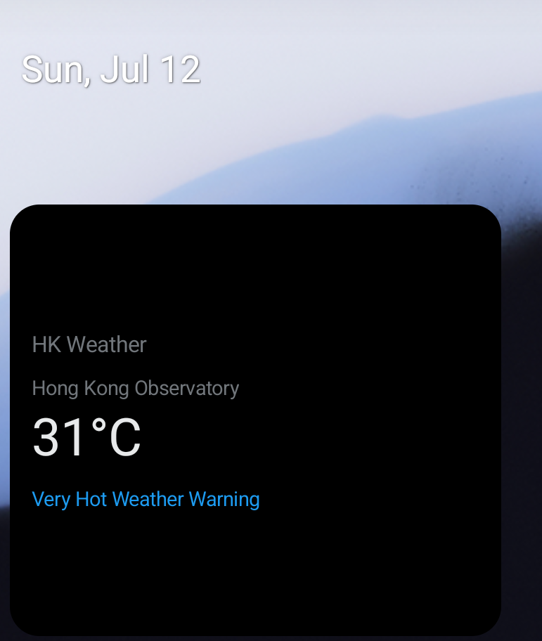

# HongKongWeather-Kotlin-Android

Kotlin Android showcase for Hong Kong weather, powered by the [HKO Open Data API](https://www.hko.gov.hk/en/weatherAPI/doc/files/HKO_Open_Data_API_Documentation.pdf).

Live data from the Hong Kong Observatory: current readings at your nearest station, active warnings, 9-day forecast, a **home screen widget**, and a temperature map across all HKO automatic weather stations.

## Showcase

### Home screen widget

Place the **HK Weather** widget on your launcher for at-a-glance conditions without opening the app.



**What you see on the widget**

| UI element | Source |
|------------|--------|
| **HK Weather** | App label |
| **Hong Kong Observatory** (or nearest station) | HKO `rhrread` temperature station |
| **31°C** | Current temperature at that station |
| **Very Hot Weather Warning** (blue text) | Active warning from `warnsum` / `rhrread` |

**How to add**

1. Long-press the home screen
2. Tap **Widgets**
3. Find **HK Weather**
4. Drag onto the home screen

Tap the widget to open the full app.

## Features

### Home screen widget

- **Glance App Widget** — built with Jetpack Glance, dark Grok-style card on true black
- **Live HKO data** — temperature, station name, warning status from the same repository as the app
- **Warning highlight** — active alerts shown in link blue; falls back to forecast text when clear
- **Auto-refresh** — WorkManager updates every 30 minutes
- **Tap to open** — launches the main weather screen
- **No extra permissions in widget context** — uses HKO Observatory data when GPS is unavailable in the widget

Implementation: `app/src/main/java/com/hkweather/app/widget/`

### Home (Now)

- Purple glassmorphism weather UI inspired by modern forecast apps
- Large weather icon + current temperature
- Today max/min from the 9-day forecast
- Humidity and rain-chance (PSR) tiles
- Horizontal 7-day forecast strip inside a glass card

### Map

- Free [OpenStreetMap](https://www.openstreetmap.org/) tiles via OSMDroid (no API key)
- Temperature overlay on 25 HKO station locations
- GPS pin for your position; nearest station highlighted

### Alerts & Forecast

- Active warnings from `warnsum` + detailed messages
- Local forecast, general situation, tropical cyclone info, outlook
- Grok-inspired dark UI: true black canvas, monochrome text, minimal chrome

### Location-aware readings

GPS → nearest HKO automatic weather station (Haversine distance). In Sha Tin, you see Sha Tin temperature — not a city-wide average.

### Navigation

Floating bottom bar: **Now · Map · Alerts · Forecast · Refresh**

## API datasets

Base URL: `https://data.weather.gov.hk/weatherAPI/opendata/weather.php`

| `dataType` | Purpose | Used in app | Used in widget |
|------------|---------|-------------|----------------|
| `rhrread` | Current temperature, humidity, icon, warning messages | Yes | Yes |
| `fnd` | 9-day forecast (max/min, icons, rain probability) | Yes | No |
| `flw` | Local weather forecast text | Yes | Fallback text |
| `warnsum` | Active warning summary | Yes | Yes |

## Tech stack

| Layer | Choice |
|-------|--------|
| Language | Kotlin |
| UI | Jetpack Compose (Material 3) |
| Architecture | MVVM — `ViewModel` + `StateFlow` |
| Networking | OkHttp + kotlinx.serialization |
| Location | Google Play Services Location |
| Map | OSMDroid + OpenStreetMap |
| **Widget** | **Glance App Widget + WorkManager** |

## Requirements

- Android Studio Ladybug or newer
- JDK 17
- Android SDK 35
- minSdk 26

## Build & run

```bash
export JAVA_HOME="/Applications/Android Studio.app/Contents/jbr/Contents/Home"
./gradlew assembleDebug
./gradlew installDebug
```

After install, add the widget from the launcher widget picker to see it in action.

## Permissions

| Permission | Why |
|------------|-----|
| `INTERNET` | Fetch HKO weather data, map tiles, and widget updates |
| `ACCESS_FINE_LOCATION` | Match nearest HKO weather station in the app |
| `ACCESS_COARSE_LOCATION` | Fallback location for station matching |

The widget does not require location permission; it shows HKO headquarters readings when GPS is not available.

## Project structure

```
app/src/main/java/com/hkweather/app/
├── data/
│   ├── api/HkoApiClient.kt
│   ├── model/WeatherModels.kt
│   └── repository/WeatherRepository.kt
├── location/
│   ├── LocationProvider.kt
│   └── WeatherStationLocator.kt
├── ui/
│   ├── home/HomeNowTab.kt          # Weather-app home screen
│   ├── map/                        # OSMDroid temperature map
│   ├── components/                 # Shared UI + glass cards
│   ├── WeatherScreen.kt
│   ├── WeatherViewModel.kt
│   └── theme/Theme.kt
├── widget/                         # Home screen widget (Glance)
│   ├── WeatherWidget.kt            # Widget UI + HKO data binding
│   └── WeatherWidgetWorker.kt      # Periodic refresh (30 min)
└── MainActivity.kt

app/src/main/res/xml/
└── weather_widget_info.xml         # Widget size & update config
```

## App icon

Adaptive launcher icon: purple gradient sky, sun, cloud, rain drops, and a location pin for the nearest HKO station. See `app/src/main/res/drawable/ic_launcher_*.xml`.

## License

See [LICENSE](LICENSE).
